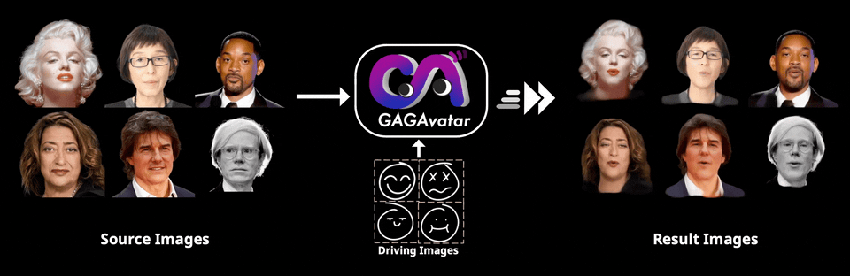

<h1 align="center"><b></b></h1>
<!-- <h3 align="center">
    <a href='https://arxiv.org/abs/2401.10215'></a> &nbsp; 
    <a href='https://xg-chu.site/project_gagavatar/'></a> &nbsp; 
    <a href='https://www.youtube.com/watch?v=7A3DMaB6Zk0'></a> &nbsp; 
</h3> -->

<h5 align="center">
    <a href="https://xg-chu.site">Xuangeng Chu</a><sup>1</sup>&emsp;
    <a href="https://www.mi.t.u-tokyo.ac.jp/harada/">Tatsuya Harada</a><sup>1,2</sup>
    <br>
    <sup>1</sup>The University of Tokyo,
    <sup>2</sup>RIKEN AIP
</h5>

<h3 align="center">
🤩 NeurIPS 2024 🤩
</h3>

<div align="center"> 
    <div align="center"> 
        <b></b>
    </div>
    <b>
        GAGAvatar reconstructs controllable 3D head avatars from single images.
    </b>
    <br>
        GAGAvatar achieves one-shot 3DGS-based head reconstruction and <b>⚡️real-time⚡️</b> reenactment.
    <br>
        🔥 More results can be found in our <a href="https://xg-chu.github.io/project_gagavatar/">Project Page</a>. 🔥
</div>

<!-- ## TO DO
We are now preparing the <b>pre-trained model and quick start materials</b> and will release it within a week. -->

## Installation
### Build environment
```
conda env create -f environment.yml
conda activate GAGAvatar
```
### Install the 3DGS renderer

<details>
<summary><span>What’s the difference between this version and the original 3DGS?</span></summary>

- We changed the number of channels so that 3D Gaussians carry 32-dim features.
- We changed the package name to avoid conflict with the original Gaussian splash.

</details>

```
git clone --recurse-submodules git@github.com:xg-chu/diff-gaussian-rasterization.git
pip install ./diff-gaussian-rasterization
rm -rf ./diff-gaussian-rasterization
```

### Prepare resources
Prepare resources with ```bash ./build_resources.sh```.

## Quick Start Guide
Driven by another **image**:
```
python inference.py --driver_path ./demos/examples/2.jpg --image_path ./demos/examples/1.jpg
```
Driven by a tracked **video**:
```
python inference.py --driver_path ./demos/drivers/obama --image_path ./demos/examples/1.jpg
``` 
Driven by a tracked **image_lmdb**:
```
python inference.py --driver_path ./demos/drivers/vfhq_driver --image_path ./demos/examples/1.jpg
```

To test the inference speed, refer to the ```speed_test()``` function in ```inference.py```.

To test your own images online, refer to ```lines 52-55``` in ```inference.py```.

## Citation
If you find our work useful in your research, please consider citing:
```bibtex
@inproceedings{
    chu2024gagavatar,
    title={Generalizable and Animatable Gaussian Head Avatar},
    author={Xuangeng Chu and Tatsuya Harada},
    booktitle={The Thirty-eighth Annual Conference on Neural Information Processing Systems},
    year={2024},
    url={https://openreview.net/forum?id=gVM2AZ5xA6}
}
```

## Acknowledgements
Some part of our work is built based on FLAME, StyleMatte, EMICA and VGGHead. 
The GAGAvatar Logo is designed by Caihong Ning.
We also thank the following projects for sharing their great work.
- **FLAME**: https://flame.is.tue.mpg.de
- **StyleMatte**: https://github.com/chroneus/stylematte
- **EMICA**: https://github.com/radekd91/inferno
- **VGGHead**: https://github.com/KupynOrest/head_detector
